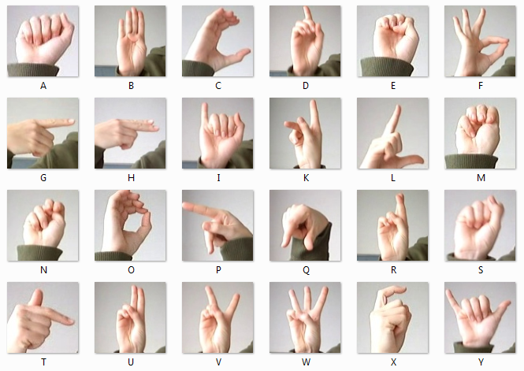

# American-Sign-Language-Prediction-using-Deep-Neural-Networks in Real-time (94.85% Accuracy)



## Overview

This project focuses on predicting sign language gestures in real-time using deep neural networks. The final tuned and trained model achieved an accuracy of 94.85%.

## About the Dataset

### Supervised Learning Dataset

The Sign Language dataset consists of 28x28 images of hands depicting the 26 letters of the English alphabet. The data is pre-processed and fed into a convolutional neural network to correctly classify each image as the letter it represents.

### Dataset Details

- **Training Dataset:** [sign_mnist_train.csv](./sign_mnist_train.csv)
- **Test Dataset:** [sign_mnist_test.csv](./sign_mnist_test.csv)

## Getting Started

### Prerequisites

Make sure you have the following libraries installed:

```bash
pip install numpy tensorflow matplotlib
import csv
import string
import numpy as np
import tensorflow as tf
import matplotlib.pyplot as plt
from tensorflow.keras.preprocessing.image import ImageDataGenerator, array_to_img
import pandas as pd
```
## Parsing the dataset (Splitting data into Training & Test datasets)
This function reads a file passed as input and return 2 numpy arrays, one containing the labels and one containing the 28x28 representation of each image within the file.

The first row contains the column headers, so you should ignore it.

Each successive row contains 785 comma-separated values between 0 and 255

The first value is the label

The rest are the pixel values for that picture
```bash
def parse_data_from_input(filename):
  with open(filename) as file:
    # Initialize empty lists to store labels and pixel data
    labels = []
    pixel_data = []

    # Using csv.reader and passing in the appropriate delimiter
    csv_reader = csv.reader(file, delimiter=',')

    # Skipping the header row (header row contains 'label', 'pixel1', 'pixel2', 'pixel3', 'pixel4')
    header = next(csv_reader)

    # Iterate over each row in the CSV file
    for row in csv_reader:
        # Extract the label and pixel data into label and pixel arrays
        label = int(row[0])  # 'label' is in the first column of the dataset
        pixels = [int(x) for x in row[1:]]  # pixel data starts from the second column to the end

        # Append the label and pixel data to their respective lists
        labels.append(label)
        pixel_data.append(pixels)

    # Converting the list of pixel data to a NumPy array with the desired shape and dtype
    images = np.array(pixel_data, dtype=float)  # Convert to float64
    images = images.reshape(-1, 28, 28)  # Reshaping 1D array of data into (27455, 28, 28)
    labels = np.array(labels, dtype=float)

    return images, labels
```
## Visualizing the numpy arrays (Single rows in the dataset)
Now that we have converted the initial csv data into a format that is compatible with computer vision tasks, lets see how the images of the dataset look like:

```bash
# Plotting a sample of 10 images from the training set for visualization
def plot_categories(training_images, training_labels):
  fig, axes = plt.subplots(1, 10, figsize=(16, 15))
  axes = axes.flatten()
  letters = list(string.ascii_lowercase)

  for k in range(10):
    img = training_images[k]
    img = np.expand_dims(img, axis=-1)
    img = array_to_img(img)
    ax = axes[k]
    ax.imshow(img, cmap="Greys_r")
    ax.set_title(f"{letters[int(training_labels[k])]}")
    ax.set_axis_off()

  plt.tight_layout()
  plt.show()

plot_categories(training_images, training_labels)
```


## Creating the generators for the CNN
Now that we have successfully organized the data in a way that can be easily fed to Keras' ImageDataGenerator, it is time for you to code the generators that will yield batches of images, both for training and validation. For this complete the train_val_generators function below.
```bash
def train_val_generators(training_images, training_labels, validation_images, validation_labels):
  """
  Creates the training and validation data generators
​
  Args:
    training_images (array): parsed images from the train CSV file
    training_labels (array): parsed labels from the train CSV file
    validation_images (array): parsed images from the test CSV file
    validation_labels (array): parsed labels from the test CSV file
​
  Returns:
    train_generator, validation_generator - tuple containing the generators
  """
# Expanding the images to include  color dimension to it
  training_images = np.expand_dims(training_images, axis=3)
  validation_images = np.expand_dims(validation_images, axis=3)
​
  # setting arguments to augment the images to enhance the training set diversity
  train_datagen = ImageDataGenerator(
      rescale = 1./255,
        rotation_range=40,
      width_shift_range=0.2,
      height_shift_range=0.2,
      shear_range=0.2,
      zoom_range=0.2,
      horizontal_flip=True,
      fill_mode='nearest')
​
  # Storing the augmented training images
  train_generator = train_datagen.flow(x=training_images,
                                       y=training_labels,
                                       batch_size=32)
​
  validation_datagen = ImageDataGenerator(rescale = 1./255)
​
  # Storing the augmented testing set images
  validation_generator = validation_datagen.flow(x=validation_images,
                                                 y=validation_labels,
                                                 batch_size=32)
​
  return train_generator, validation_generator
```

## Coding the CNN
Define the architecture of the model.

The create_modelfunction returns a Keras' model that uses the Sequential API.

The last layer of your model is built to have a number of units equal to the number of letters in the English alphabet. It uses an activation function that will output the probabilities per letter. So Softmax function is used.

Aside from defining the architecture of the model, compiling it so make sure to use a loss function is suitable for multi-class classification.
```bash
## # Sending training data into the built architecture to train
model = create_model()

# Training the model
history = model.fit(train_generator,
                    epochs=15,
                    validation_data=validation_generator)
```
### Convolutional Layer


### Max Pooling Layer


### Flatten Layer


### Dense Layer


## Plotting Loss & Accuracy
```bash
# Plotting the chart for accuracy and loss on both training and validation
acc = history.history['accuracy']
val_acc = history.history['val_accuracy']
loss = history.history['loss']
val_loss = history.history['val_loss']

epochs = range(len(acc))

plt.plot(epochs, acc, 'r', label='Training accuracy')
plt.plot(epochs, val_acc, 'b', label='Validation accuracy')
plt.title('Training and validation accuracy')
plt.legend()
plt.figure()

plt.plot(epochs, loss, 'r', label='Training Loss')
plt.plot(epochs, val_loss, 'b', label='Validation Loss')
plt.title('Training and validation loss')
plt.legend()

plt.show()
```


